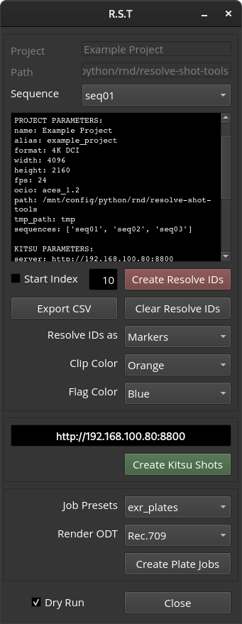

# resolve-shot-tools
Utility to help with VFX pulls from Davinci Resolve Timelines



## Features
- Creates shot names from current Davinci Resolve Timeline.
- Creates Render jobs for generation of plates for VFX work.
- Generates shot entries for Kitsu shot management.
- YAML based configuration files for shot nameming, metadata, etc.

## Requirments
### Python
- Python 3.xx
- PySide6
- PyYAML
- numpy
- gazu
- Pillow

### Software
- Davinci Resolve
- Running Kitsu Server with admin priviledges 


## Usage
- Resolve needs to be running with the relevant timeline opened.
```
python rst_gui.py -p <project name>
```
Example Project
```
python rst_gui.py -p example_project
```
## Configuration
### Resolve Python API
- Edit ```./resolve_tools/resolve_connect.py``` to point to your Resolve installation Resolve Python API modules.
  
### Config Files
Configuration is currently manual by editing the YAML configuration files in the **config** folder.

Additional per-project configuration file need to be created and edited. An example project is included in the **example_project** folder.

- Edit the ```./config/proj_master_config.yaml``` file to add your projects
- Edit the ```./config/default_proj_config.yaml``` file to set default parameters for all your projects
- Create and edit per project ```config.yaml``` files to se overrides for specific project parameters. This file should be placed in the ```<project root dir>/config``` folder. An example is provided in the ```./example_project``` folder.
- Any setting set at the project level ```config.yaml``` file overrides the same setting on the ```default_proj_config.yaml```. Only seetings that are differnt can be added.


### Resolve Timeline

- In the Resolve Timeline, name the Video Track where the VFX pulls should happen, i.e. ```SRC```
- Edit the configuration file to reflect this in the ```resolve``` section.
```
#Resolve
resolve:
  vfx_plate_trk_name: SRC  
```
- Curently this name is used to name the rendered plates. This can be changed in Naming section of the project configuration file.

### Kitsu
A Kitsu Project need to be present. The project name should be mirrored in the ```proj_master_config.yaml``` file.

Kitsu Server URL can be edited in the configuration files. You need administrative credentials to publish Kitsu shot entries. The creadential are read fomr the following System Environment Variables:
```
TX_KITSU_ADMIN = username
TX_KITSU_PASWD = password
```
In addition, valid Task and Status enries need to be defined in the Kitsu Project. These need to match the ones set in the Kistu section of the configuration files.


## Notes and Disclaimer 
This project is a HEAVY work in progres and some sections will brake. I am an artist not a developer and the code is far from being efficient. This project is provided as a proof of concept for a more robust tool.
